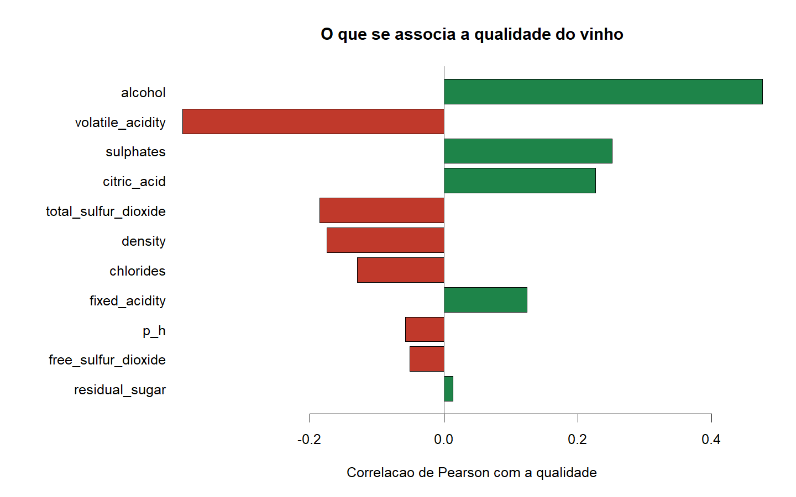
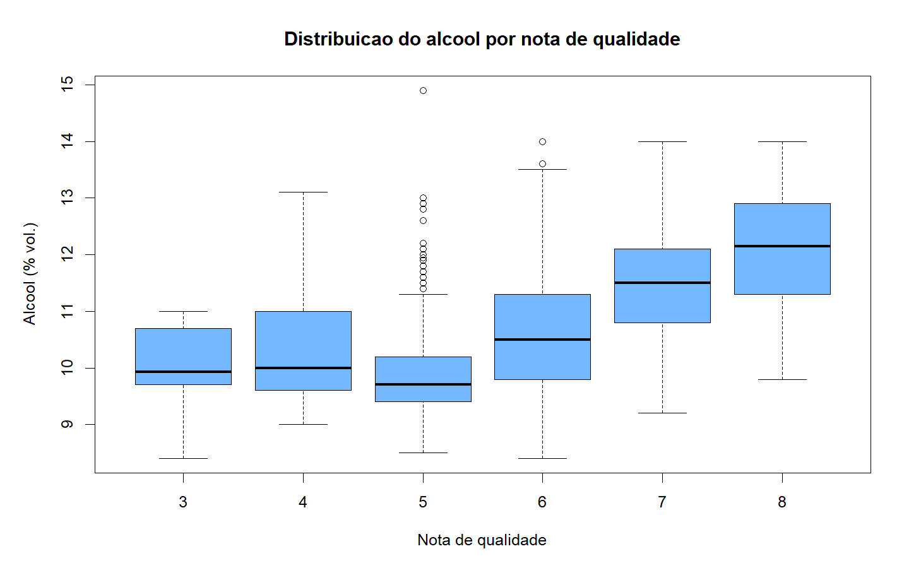
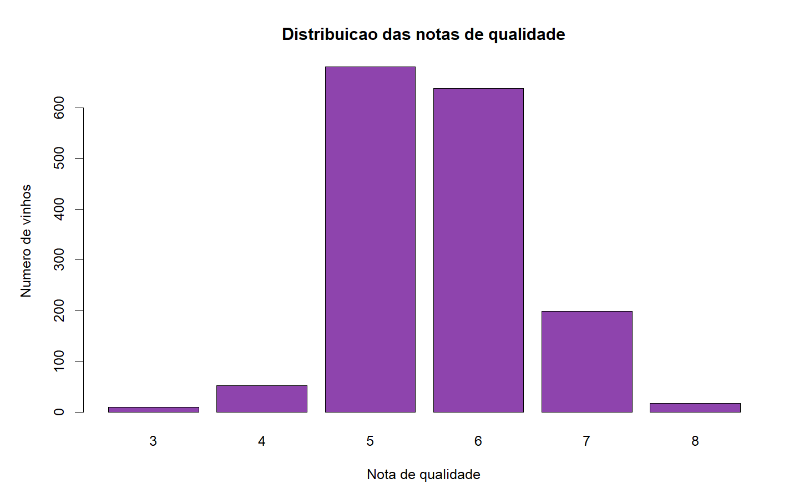

# Red Wine Quality in R | Physicochemical Drivers

Reproducible analysis of **1,599 Portuguese red wines** (Vinho Verde) to identify which chemical
properties track the highest tasting scores.

**Stack:** R 4.5.2 · base R only · no external dependencies

---

## Headline finding

> **Alcohol tracks quality most strongly (r = +0.48). Volatile acidity penalises it most
> (r = −0.39).** No other variable exceeds ±0.26.



| Variable | Correlation with quality |
|---|---:|
| Alcohol | **+0.476** |
| Volatile acidity | **−0.391** |
| Sulphates | +0.251 |
| Citric acid | +0.226 |
| Total sulfur dioxide | −0.185 |
| Density | −0.175 |
| Chlorides | −0.129 |
| Fixed acidity | +0.124 |
| pH | −0.058 |
| Free sulfur dioxide | −0.051 |
| Residual sugar | +0.014 |

The average profile confirms it directly:

| Quality group | Wines | Alcohol | Volatile acidity | Sulphates | Citric acid |
|---|---:|---:|---:|---:|---:|
| Low (3-5) | 744 | 9.93 | 0.590 | 0.619 | 0.238 |
| Medium (6) | 638 | 10.63 | 0.497 | 0.675 | 0.274 |
| High (7-8) | 217 | **11.52** | **0.406** | 0.743 | 0.376 |



## The problem the numbers hide

**82.5% of the wines score 5 or 6.** The extremes barely exist: 10 wines at 3 and 18 at 8,
out of 1,599.

| Score | Wines | % |
|---:|---:|---:|
| 3 | 10 | 0.6% |
| 4 | 53 | 3.3% |
| 5 | 681 | 42.6% |
| 6 | 638 | 39.9% |
| 7 | 199 | 12.4% |
| 8 | 18 | 1.1% |



This has practical consequences: any model trained on this dataset will do well on scores 5 and 6
and fail precisely on the wines worth distinguishing, the excellent and the poor. The correlations
above are computed on a sample concentrated in the middle of the scale and should not be
extrapolated to the extremes.

## Methodological decision: the 240 duplicates were kept

The dataset contains **240 rows identical to other rows**. They were not removed.

There is no sample identifier. Two identical rows may be a data-entry error, or two different
wines with the same twelve measurements, which is entirely possible with values rounded to one or
two decimal places. Removing them is not the conservative option: it would assume an error that
nothing proves. The duplicates are quantified in `07_TABELAS/validacao_limpeza.csv` so that
anyone reusing the data can decide with full information.

## Method

1. **Import** — original CSV read from `01_DADOS_BRUTOS`, unchanged.
2. **Inspect** — dimensions, missing values and exact duplicates measured before cleaning.
3. **Clean** — column names normalised to snake_case.
4. **Transform** — derive `quality_group` (low 3-5 / medium 6 / high 7-8).
5. **Validate** — quality record written to `07_TABELAS/validacao_limpeza.csv`.
6. **Analyse, plot and export.**

**Data quality:** 1,599 rows to 1,599 rows · 0 missing values · **240 exact duplicates, kept** ·
0 rows removed.

## Reproduce

```bash
Rscript 04_SCRIPTS_R/09_executar_pipeline.R
```

## Structure

```
01_DADOS_BRUTOS/    raw data, immutable
03_DADOS_LIMPOS/    cleaned data, pipeline output
04_SCRIPTS_R/       9 stages, one per file
05_NOTEBOOKS/       R Markdown notebook for Kaggle
06_GRAFICOS/        PNG charts
07_TABELAS/         result tables as CSV
09_DOCUMENTACAO/    data dictionary and dependencies
```

## Limitations

Correlation is not causation, and here the warning is concrete: raising the alcohol content of a
wine does not make it better. It is more plausible that riper grapes produce both more alcohol and
better wine, which would make alcohol a marker of ripeness rather than the cause of quality. The
concentration of the sample in scores 5 and 6 further limits any generalisation.

## Data

Wine Quality (red) — Cortez, Cerdeira, Almeida, Matos and Reis, University of Minho, published in
the UCI Machine Learning Repository. Vinho Verde samples from north-west Portugal.
The original CSV sits unchanged in `01_DADOS_BRUTOS`.

## Licence

Code released under the MIT Licence (see `LICENSE`). The dataset keeps the terms of its original
source (UCI, CC BY 4.0).
